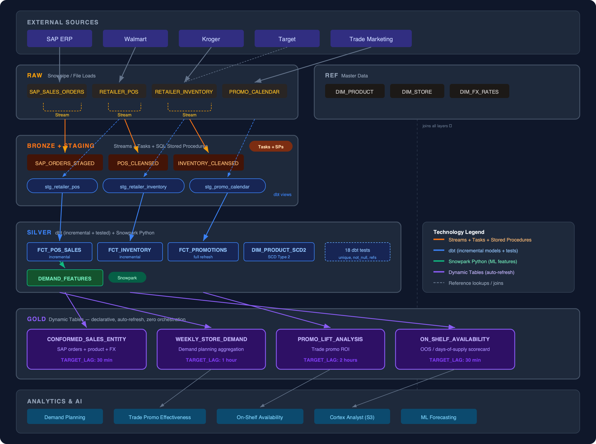

# Retail Transformation Demo

A complete Snowflake data engineering demo showing four transformation approaches — **Dynamic Tables**, **Streams + Tasks**, **Snowpark Python**, and **dbt** — working together to take raw retail data from landing to analytics-ready.

---

## What This Demonstrates

### Dynamic Tables (Gold Layer)
Declarative, auto-refreshing analytical datasets. Define the SQL, set a `TARGET_LAG` SLA, and Snowflake handles incremental refresh — no orchestration code.

- **Conformed Sales Entity** — SAP orders joined to product master and FX rates (30 min lag)
- **Weekly Store Demand** — store/brand/week aggregation for demand planning (1 hour lag)
- **Promo Lift Analysis** — promotional vs baseline sales comparison with ROI (2 hour lag)
- **On-Shelf Availability** — out-of-stock detection and days-of-supply scorecard (30 min lag)

### Streams + Tasks + Stored Procedures (Bronze Layer)
Event-driven CDC pipelines that fire automatically when new data lands.

- **Streams** on each raw table detect inserts without polling
- **Tasks** trigger on `SYSTEM$STREAM_HAS_DATA` — zero wasted compute
- **SQL Stored Procedures** encapsulate multi-step logic: type-casting, retailer-specific date normalization, UPC validation, error quarantine
- **Task DAG** with a child quality-audit task that runs after POS processing

### Snowpark Python (Silver Layer)
Python DataFrames running natively inside Snowflake — no data movement.

- **POS Enrichment** — UPC validation, retailer-specific date parsing, product master join, derived metrics (kg sold, revenue per kg)
- **Demand Feature Engineering** — rolling 7d/28d averages, week-over-week growth, day-of-week seasonality, promo running count for ML forecasting

### dbt (Silver Layer)
Model-based SQL transformation with version control, testing, and lineage.

- **Incremental models** — `fct_pos_sales` and `fct_inventory` with merge strategy
- **Full-refresh models** — `fct_promotions` with promo duration calculation
- **SCD Type 2** — `dim_product_scd2` tracking product attribute changes
- **18 automated tests** — unique, not_null, accepted_range, referential integrity
- **Deployed as a Snowflake-native dbt project** via `snow dbt deploy`

---

## Scenario

A CPG company receives daily POS sell-through data, inventory snapshots, and promotional calendars from retail partners (Walmart, Kroger, Target) plus SAP sales orders internally. Raw feeds are transformed into analytics-ready datasets for demand planning, trade promotion effectiveness, and on-shelf availability.

### Sample Data
- **8 products** across 5 brands: Sunrise (coffee), ChocoCrunch (chocolate), PetPrime (pet food), QuickBite (noodles), CrystalSpring (water)
- **7 stores** across 3 retailers with regional coverage
- **15 POS transactions**, 8 inventory snapshots, 4 promotional campaigns, 8 SAP orders

---

## Architecture



---

## Decision Framework

| Approach | Best For | Used In This Demo |
|----------|----------|-------------------|
| **Dynamic Tables** | Declarative aggregations, SLA-driven refresh, no orchestration | Gold-layer analytics where freshness matters |
| **Streams + Tasks** | Event-driven CDC, conditional execution, complex DAGs | Raw → Bronze when logic depends on data arrival |
| **Snowpark** | Python/ML logic, UDF-heavy transforms, feature engineering | Retailer-specific parsing, rolling window features |
| **dbt** | SQL-first teams, version control, testing, documentation | Silver-layer conforming where auditability matters |

---

## RBAC

```
SYSADMIN
└── DEMO_ADMIN (owns database)
    └── DEMO_ENGINEER (builds pipelines, runs tasks)
        ├── DEMO_TRANSFORMER (dbt, Snowpark, DT refresh)
        └── DEMO_ANALYST (read-only silver/gold)
```

| Role | Schemas | Warehouse |
|------|---------|-----------|
| ENGINEER | RAW, BRONZE, STAGING, REF (all) | DEMO_ETL_WH |
| TRANSFORMER | SILVER, GOLD (write); RAW, BRONZE, REF (read) | DEMO_TRANSFORM_WH, DEMO_ANALYTICS_WH |
| ANALYST | SILVER, GOLD (select only) | DEMO_ANALYTICS_WH |

---

## Setup

### Prerequisites
- Snowflake account with ACCOUNTADMIN access
- [Snowflake CLI](https://docs.snowflake.com/en/developer-guide/snowflake-cli) (`snow`) installed

### 1. Deploy Infrastructure & Load Data

Run the SQL files in order. Within each folder, run by filename order.

```
sql/00_setup/01 → 02 → 03 → 04     (SECURITYADMIN / SYSADMIN)
sql/01_raw_staging/01 → 02           (DEMO_ENGINEER)
sql/03_streams_tasks/01 → 02 → 03   (DEMO_ENGINEER)
```

### 2. Deploy & Run dbt Project

```bash
# Create the EAI for dbt package resolution (ACCOUNTADMIN)
# See sql/00_setup/ for network rule + EAI creation

# Deploy to Snowflake
snow dbt deploy RETAIL_TRANSFORM_DBT \
  --source ./dbt \
  --database RETAIL_TRANSFORM_DEMO \
  --schema SILVER \
  --external-access-integration DEMO_DBT_EAI

# Build all models + run tests
snow dbt execute \
  --database RETAIL_TRANSFORM_DEMO \
  --schema SILVER \
  RETAIL_TRANSFORM_DBT build --full-refresh
```

Expected result: `PASS=25 WARN=0 ERROR=0 SKIP=0 TOTAL=25`

### 3. Create Dynamic Tables

```
sql/02_dynamic_tables/01             (DEMO_TRANSFORMER)
```

### 4. Snowpark Procedures (optional)

```
sql/04_snowpark/01 → 02             (DEMO_TRANSFORMER)
```

Call them with:
```sql
CALL BRONZE.SP_SNOWPARK_POS_ENRICHMENT();
CALL SILVER.SP_BUILD_DEMAND_FEATURES();
```

### Teardown

```
sql/99_teardown/01_teardown.sql     (ACCOUNTADMIN)
```

Drops everything: database, warehouses, EAI, roles, service user.

---

## File Structure

```
sql/
├── 00_setup/
│   ├── 01_roles_and_users.sql         RBAC: roles, hierarchy, service user
│   ├── 02_database_schemas.sql        Database + 6 schemas (RAW → GOLD)
│   ├── 03_warehouses.sql              3 warehouses (ETL, Transform, Analytics)
│   └── 04_grants.sql                  Least-privilege grants + future grants
├── 01_raw_staging/
│   ├── 01_tables.sql                  Landing tables (VARCHAR), ref/master data
│   └── 02_sample_data.sql             Demo seed data (POS, inventory, promos, SAP)
├── 02_dynamic_tables/
│   └── 01_dynamic_tables.sql          4 Gold-layer DTs with varying TARGET_LAG
├── 03_streams_tasks/
│   ├── 01_streams.sql                 CDC streams on raw landing tables
│   ├── 02_stored_procedures.sql       3 SQL SPs + bronze output tables
│   └── 03_tasks.sql                   Task DAG with stream triggers
├── 04_snowpark/
│   ├── 01_snowpark_pos_enrichment.sql Python SP: UPC validation, enrichment
│   └── 02_snowpark_demand_features.sql Python SP: ML feature engineering
├── 05_dbt/
│   ├── 00_dbt_project_config.sql      Reference dbt config (non-executable)
│   └── models/silver/                 SQL equivalents of dbt models
└── 99_teardown/
    └── 01_teardown.sql                Complete cleanup script

dbt/
├── dbt_project.yml
├── profiles.yml
├── packages.yml
├── macros/
│   └── generate_schema_name.sql       Routes models to correct schemas
├── models/
│   ├── staging/                       3 staging views (→ BRONZE schema)
│   └── silver/                        3 fact tables + schema tests (→ SILVER)
└── seeds/
```
